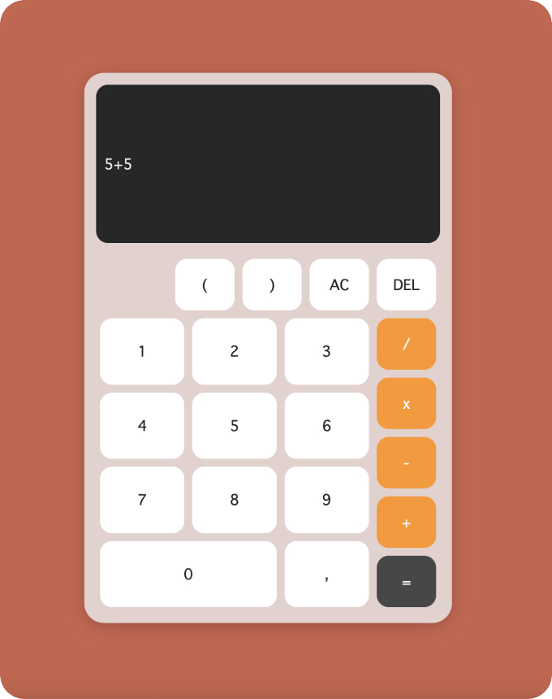

# Calculator

Static HTML calculator written while learning TypeScript. The UI is French. It uses a comma as the decimal separator and `x` for multiply.

## Use

Open `index.html` in a browser. The page loads `css/style.min.css` and `js/index.min.js`.

Source lives in `css/style.scss` and `js/index.tsx`. This repo has no build step. If you edit the source, compile those two files and keep the `.min` files in sync.

## License

MIT. See `LICENSE`.
